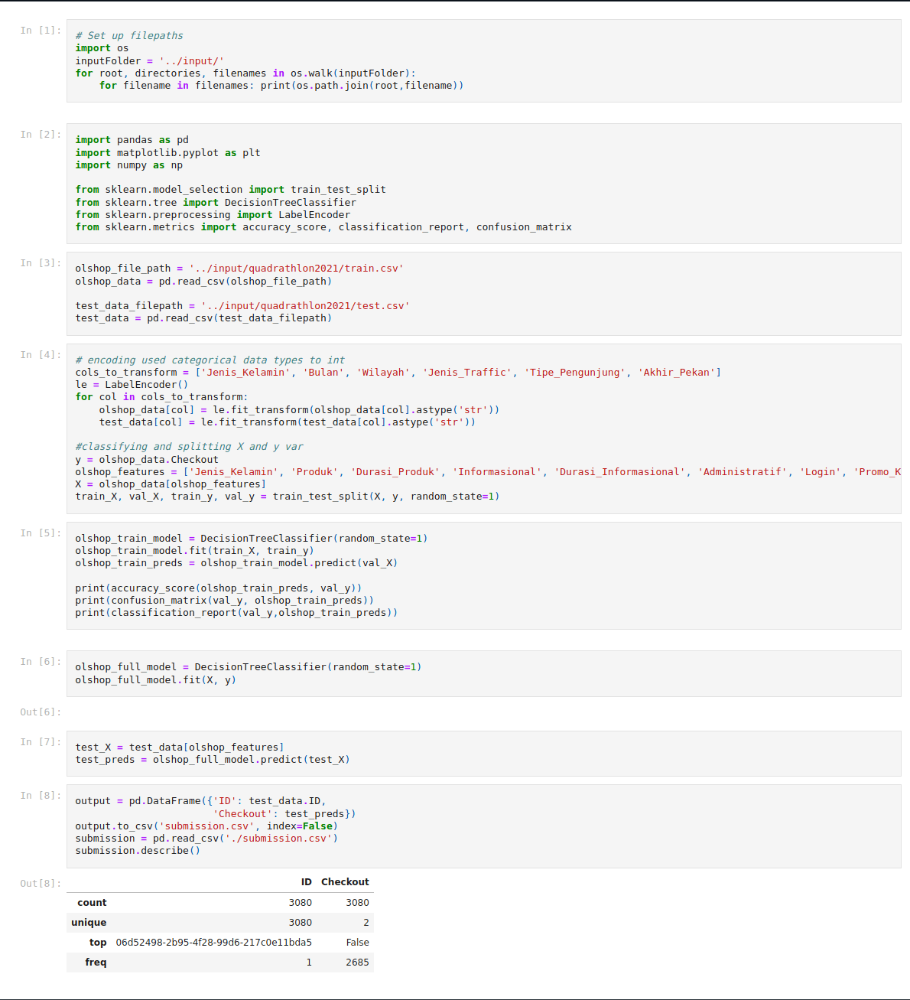

# Quad2021 Data Mining
Showcase for my team's works on Quadrathlon 2021 Data Mining, anggota :
- Mohammad Fadhil Rasyidin Parinduri (5025201131)
- Nuzul Abatony (5025201107)
- Muhammad Ghani Taufiqurrahman Atmaja (5025201110)

## Tentang Quadrathlon
Kompetisi Data Mining Quadrathlon adalah kegiatan kompetisi internal tahunan yang diselenggarakan oleh Departemen Keprofesian dan Teknologi HMTC ITS. Kompetisi Quadrathlon sendiri terdiri dari lima cabang, yaitu Competitive Programming, Data Mining, Capture The Flag, Game Development, dan Software Application.

## Konteks
Prediksi apakah pembeli akan melakukan pembelian secara online atau tidak. Dataset ini berisi Data Niat Pembelian Pembeli Online.

Dataset terdiri dari 25 atribut. 13 atribut bernilai String, 3 atribut bernilai integer, 7 atribut bernilai decimal, dan 2 atribut bernilai boolean. Atribut Checkout digunakan sebagai atribut target.

## Kolom CSV
| ID                   | identifier unik pengunjung                                                                                                            |
| -------------------- | ------------------------------------------------------------------------------------------------------------------------------------- |
| Jenis_Kelamin        | Jenis kelamin pengunjung                                                                                                              |
| Produk               | Jenis halaman produk terkait yang dikunjungi pengunjung dalam sesi tersebut                                                           |
| Durasi_Produk        | Total waktu yang dihabiskan di halaman produk terkait                                                                                 |
| Informasional        | Jenis halaman informatif yang dikunjungi pengunjung dalam sesi tersebut                                                               |
| Durasi_Informasional | Total waktu yang dihabiskan di halaman informatif                                                                                     |
| Administratif        | Jenis halaman administratif yang dikunjungi pengunjung dalam sesi tersebut                                                            |
| Durasi_Administratif | Total waktu yang dihabiskan di halaman administratif                                                                                  |
| Login                | Apakah pengunjung login pada sesi tersebut                                                                                            |
| Promo_Klik           | Apakah pengunjung menekan banner promo pada sesi tersebut                                                                             |
| Favorit_Klik         | Apakah pengunjung menekan icon favorit pada sesi tersebut                                                                             |
| Favorit_Tambah       | Apakah pengunjung melihat list favorit pada sesi tersebut                                                                             |
| Keranjang_Klik       | Apakah pengunjung menekan icon keranjang pada sesi tersebut                                                                           |
| Rate_Pentalan        | Mengacu pada persentase pengunjung yang masuk ke situs dari halaman itu dan memberikan permintaan lain ke server selama sesi tersebut |
| Rate_Keluar          | Mewakili metrik yang diukur oleh Google Analytics untuk setiap halaman e-commerce tersebut                                            |
| Nilai_Halaman        | Mewakili nilai rata-rata untuk halaman web yang dikunjungi pengguna sebelum menyelesaikan transaksi                                   |
| Bulan                | Bulan kunjungan                                                                                                                       |
| Hari_Spesial         | Menunjukan kedekatan waktu kunjungan dengan hari khusus tertentu (misal Hari Raya, Hari Ibu)                                          |
| Akhir_Pekan          | Apakah tanggal kunjungan adalah hari weekend                                                                                          |
| Wilayah              | Wilayah tempat pengunjung mengakses                                                                                                   |
| Browser              | Tipe browser yang digunakan                                                                                                           |
| Jenis_Traffic        | Tipe Traffic                                                                                                                          |
| Tipe_Pengunjung      | Tipe pengunjung, pengunjung baru atau pengunjung kembali                                                                              |
| Checkout             | Atribut Target, apakah pengunjung berakhir melakukan transaksi?                                                                       |

## file
you can check train.csv and test.csv on ./files	 
- train.csv - dataset training
- test.csv - dataset testing
- sample_submission.csv - contoh submission dengan format yang sesuai

## ipnyb snippet 
